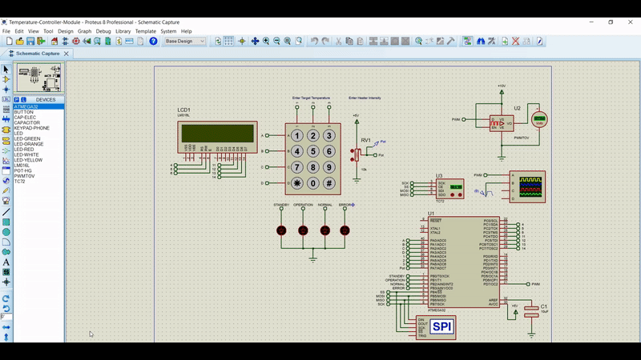

# Temperature Controller Module

- [1. Installation](#1-installation)
- [2. System Objective](#2-system-objective)
- [3. System Components](#3-system-components)
- [4. System Interface](#4-system-interface)
- [5. System Operation](#5-system-operation)
- [6. System Design](#6-system-design)
- [7. MISRA-C: 2004 Compliant](#7-misra-c-2004-compliant)

<!-- Installation -->
<!--<h1 id="installation">Installation</h1>-->

# 1. Installation

The Software used in this project is `Proteus Design Suite`, it is a proprietary software tool suite used primarily for electronic design automation.

It's better to use the same version of the simulation or a newer version to open the simulation file without any problems. We used `Proteus 8.10`.

Download Link:
<a href="https://1337x.to/torrent/4617068/Proteus-Professional-v8-10-SP3-Build-29560-Pre-Cracked-CracksHash/
" target="_blank">Proteus 8.10 SP3</a>

<!-- System Objective -->
<!--<h1 id="system-objective">System Objective</h1>-->
# 2. System Objective

Temperature Controller Module is a System designed to provide Temperature Control Functionality in different states. The system provides the ability to reach a targeted temperature called `SET_TEMPERATURE` which is determined by a user interface.

To simulate the heating process, the system uses a Voltage Control Module (PWM) with a selected Intensity controlled by the user.

System states are being displayed to the user during the run-time, so the user can know the current system state and which process is running in the background.

<!-- System Components -->
<!--<h1 id="system-components">System Components</h1>-->
# 3. System Components

The system is composed of the following components:
- `Microcontroller`: ATmega32 Microcontroller
- `LCD`: Display Target and Current Temperatures and System States
- `Keypad`: 4x3 keypad for user Interface and control states switching
- `TC72` : Temperature Sensor Module Based on SPI Protocol
- `Potentiometer`: A Calibration Resistor used as the Heater Intensity Controller
- `PWM to Voltage Converter`: Converts the PWM to a targeted decimal voltage

<!-- System Interface -->
<!--<h1 id="system-interface">System Interface</h1>-->
# 4. System Interface

Below is the System Design Interface on Proteus 8.10.

On the left side: all the user interactions are collected; `LCD Display`, `Keypad`, `Potentiometer` and `System State LEDs`. 

On the right side: the backbone of the System is collected; `ATmega32 Microcontroller`, `TC72 Temperature Sensor` and `PWM to Voltage Converter`. 

For the sake of testing, we added an `Oscilloscope` to simulate the Heating Process when Enabling/Disabling the PWM with different Duty Cycles.

<!-- System Operation -->
<!--<h1 id="system-operation">System Operation</h1>-->
# 5. System Operation

In this section we will describe the flow-work of the system from the beginning of the simulation to the end for each state.

<h3>Start Simulation</h3>

When you run the simulation you will see an animation of `"Welcome"` word, starts from the right side of the screen till the left side forth and back 3 times. Then the Idle Screen is displayed with some default values such as the target temperature **25 C&deg;** and the current system state. This is the `STANDBY` state, the first state that System starts with.

<h3>System States</h3>

The System Operates in 4 different States: 

#### `STANDBY STATE`

- At this state, the system does nothing, just the LCD and the Keypad are functioning. The system waits the user to enter the target temperature, Aka. **SET_TEMPERATURE** which the system will try to reach when it starts the operation.

- To switch to the second state, the user shall press `'#'` key on the Keypad.

- Here's an animated GIF from the demo:

    

#### `OPERATION STATE`

- At this state, the other modules such as **Temperature Sensor**, **Potentiometer** and the **PWM** shall start their functionalities.

- The Current Temperature received from the temperature sensor is updated periodically every `200ms` and is compared with the target temperature to calculate the Target Voltage which will be applied to the **PWM to Voltage Converter**. The heater is currently working and the oscilloscope is displaying the square wave in a `1KHz` frequency 

- To simulate the increase/decrease in the current temperature in Proteus, you have to adjust the value in the sensor by yourself via the  **'&#8593;'** or **'&#8595;'** arrow in the sensor.

- When the difference between the target and current temperature is **&leq;** **5**, this indicates that the heater has done its job and reaches the NORMAL STATE. 

    

#### `NORMAL STATE`

- At this state, the system has reached the desired target temperature.

- The heater is not functioning now, thus the PWM output voltage is **0**, no operation is running.

- The user can switch to `STANDBY STATE` by pressing `'#'` key on the keypad.

- If the system didn't follow this behavior, it will switches to the ERROR STATE

    

#### `ERROR STATE`

- At this state, we have 2 error cases:
    1. The system has reached the NORMAL STATE and turned off the heater, but the current temperature is still increasing, which indicates that there is a problem in the heater. 
    
    2. The system failed to reach the target temperature in a 3 minutes, which also indicates that there is a problem and the heater is not working.
    
- You have to POWER OFF the whole system to exit this state as the keypad is not working anymore and nothing is functioning.

    

<h3>STATES Diagram</h3>

We draw this diagram to describe the system states in a better way. This diagram shows the relations between the states, how the system can switches between states and which components are functioning at each state. 

<!-- System Design -->
<!--<h1 id="system-design">System Design</h1>-->
# 6. System Design

We followed a Layered Architecture to best design our System to meet the User's needs. The Layers Starts from the Top at our Main Script which is a Higher Manager **(Mode Manager)**, Next come the Lower Managers **Heater Control**, **Display Manager**, **Scheduler** and **Temperature Manager**. These four Managers are the Process Controllers for the Mode Manager.

Each Manager has a defined set of Tasks:

- `Display Manager`: Main Controller of the LCD Display Functionalities. Displays both Welcoming Screen, Idle Screen, System States and Temperatures Readings.

- `Heater Control`: Controls the Heater's Functionalities; Disabling/Enabling the Heater, Heater Intensity Control, System States Check and System State LEDs.

- `Temperature Manager`: Main Interface to the TC72 Sensor, also responsible for updating the current and target temperatures.

- `Scheduler`: This is the Timer Manager as most of our tasks are Periodic like reading the sensor's value every **200ms** and Updating Heater Intensity every **500ms**.

We draw this `UML diagram` to describe the system design in a better way. This diagram shows the relations between the managers and their dependencies in the whole project.

<!-- MISRA-C: 2004 Compliant -->
<h1 id="system-design">MISRA-C: 2004 Compliant</h1>

We used <a href="https://www.ti.com/tool/CCSTUDIO" target="_blank">Code Composer Studio</a> to check for MISRA-C: 2004 rules. The whole project is compliant with this version except 3 warnings we justified them in the code.

<!-- Demo Video -->
<h1 id="demo-video">Demo Video</h1>

We recorded this video to explain the system states, system design, and test the simulation on Proteus.

Here is the video link: <a href="https://www.youtube.com/watch?v=IQxDjfwDjPM" target="_blank">Demo Video</a>

<!-- License -->
<h1>Authors</h1>

Copyright © 2021, **Team #3**. Biomedical Engineering Department, Cairo University.